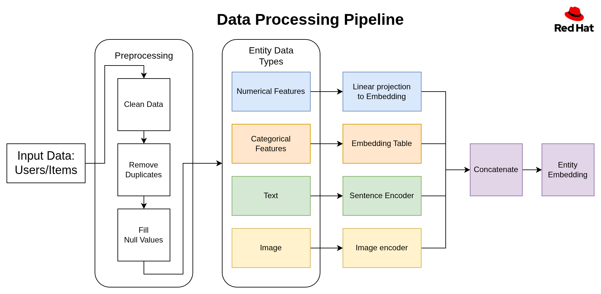
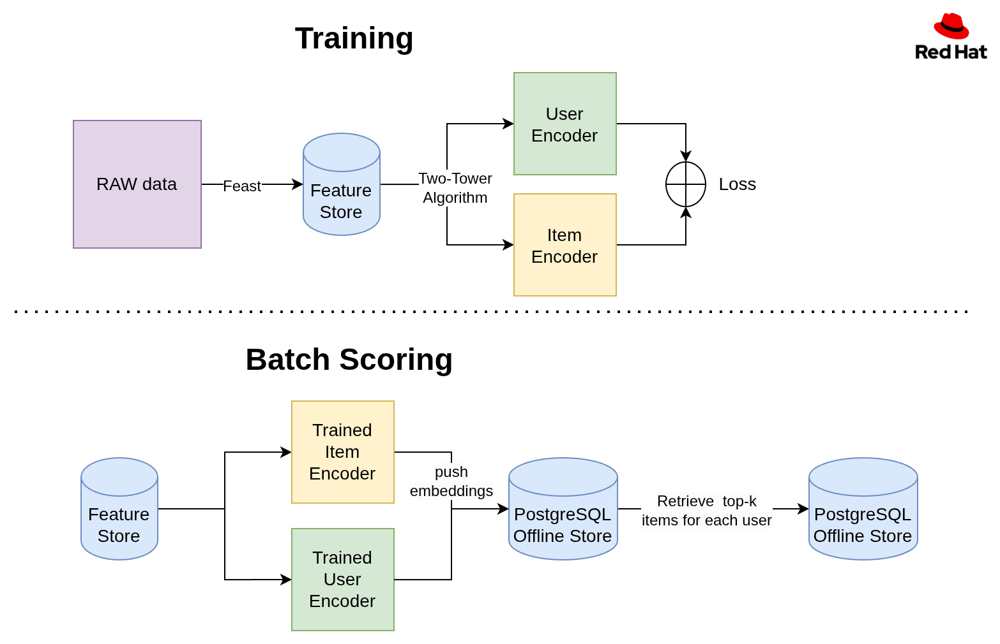
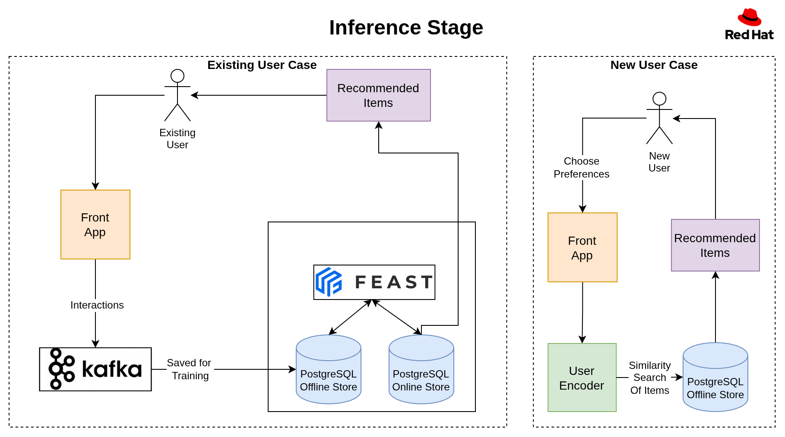
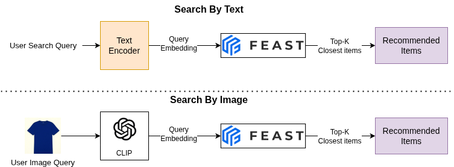

# AI Kickstart - Product Recommender System

Welcome to the Product Recommender System Kickstart!
Use this to quickly get a recommendation engine with user-item relationships up and running in your environment.

To see how it's done, jump straight to [installation](#install).

## Description
The Product Recommender System Kickstart enables the rapid establishment of a scalable and personalized product recommendation service.

The system recommends items to users based on their previous interactions with products and the behavior of similar users.

It supports recommendations for both existing and new users. New users are prompted to select their preferences to personalize their experience.

Users can interact with the user interface to view items, add items to their cart, make purchases, or submit reviews.

### Main Features
To find products in the application you can do a:
* Scroll recommended items.
* Search items by text (semantic search).
* Search items by Image (find similar items in the store).

## Related Repositories
* [rec-sys-app](https://github.com/RHEcosystemAppEng/rec-sys-app/tree/main)
  1. Main project repository for data scientists/ engineers.
  2. Contains data-generation flow & train-workflow reserach notebooks
  3. Containes Feast feature store.
* [rec-sys-workflow](https://github.com/RHEcosystemAppEng/rec-sys-workflow)
  1. This repo containes the training workflow for the recommendation system.
  2. It loads data from the feast feature store.
  3. Trains the 2-tower model.
  4. Generates reccomedations.
* Current repo
  1. Deploys the app end-to-end with including the data generation and training pipeline using helm.
  2. Has a frontend and backend functionality.

## Architecture diagrams
Components of Recommender System

### Data Proprocessing


### Training & Batch scoring

#### Recommendation algorithm stages:

1. **Filtering**
Removes invalid candidates based on user demographics (e.g., age, item availability in the region) and previously viewed items.

2. **Ranking**
Identifies the most relevant top-k items based on previuos intercations between users and items (trained with two-tower algorithm).

3. **Business Ordering**
Reorders candidates according to business logic and priorities.

#### Training
* Feast takes the Raw data (item table, user table, interaction table) and stores the items, users, and interactions as Feature Views.
* Using the Two-Tower architecture technique, we train the item and user encoders based on the existing user-item interactions.



#### Batch scoring
* After completing the training of the Encoders, embed all items and users, then push them in the PGVector database as embedding.
* Because we use batch scoring, we calculates for each user the top k recommended items using the item embeddings
* Pushes this top k items for each user to the online store Feature Store.

### Infernece
#### Exiting user case:
* Sending a get request from the EDB vectorDB to get the embedding of the existing user.
* Perform a similarity search on the item vectorDB to get the top k similar items.

#### New user case:
* The new users will be embedded into a vector representation.
* The user vector will do a similarity search from the EDB PGVector to get the top k suggested items



### Search by Text & Search by Image
1. Embed the user query into embeddings.
2. Search the top-k clostest items that where generated with the same model at batch infernece time.
3. Return to user the recommended items




## Requirements

### Minimum hardware requirements

Depend on the scale and speed required, for small amount of users have minimus of:
* No GPU required; for larger scale and faster preformance, use GPUs.
* 4 CPU cores.
* 16 Gi of RAM.
* Storage: 8 Gi (depend on the input dataset).
## References

### Required software

* `oc` command installed
* `helm` command installed
* Red Hat OpenShift.
* Red Hat OpenShift AI version 2.2 and above.
* Red Hat Authorino Operator (stable update channel, version 1.2.1 or later)
* Red Hat OpenShift Serverless Operator
* Red Hat OpenShift Service Mesh Operator

#### Make sure you have configured
Under openshiftAI DataScienceCluster CR change modelregistry, and feastoperator to `Managed` state which by default are on `Removed`:
```
apiVersion: datasciencecluster.opendatahub.io/v1
kind: DataScienceCluster
metadata:
  name: default-dsc
...
spec:
  components:
    codeflare:
      managementState: Managed
    kserve:
      managementState: Managed
      nim:
        managementState: Managed
      rawDeploymentServiceConfig: Headless
      serving:
        ingressGateway:
          certificate:
            secretName: rhoai-letscrypt-cert
            type: Provided
        managementState: Managed
        name: knative-serving
    modelregistry:
      managementState: Managed
      registriesNamespace: rhoai-model-registries
    feastoperator:
      managementState: Managed
    trustyai:
      managementState: Managed
    kueue:
      managementState: Managed
    workbenches:
      managementState: Managed
      workbenchNamespace: rhods-notebooks
    dashboard:
      managementState: Managed
    modelmeshserving:
      managementState: Managed
    datasciencepipelines:
      managementState: Managed
```

### Required permissions

* Standard user. No elevated cluster permissions required

## Install

1. Fork and clone the repository:
   ```bash
   # Fork via GitHub UI, then:
   git clone https://github.com/<your-username>/product-recommender-system.git
   cd product-recommender-system
   ```

2. Navigate to the helm directory:
   ```bash
   cd helm/
   ```

3. Set the namespace environment variable to define on which namepsace the kickstart will be install:
   ```bash
   # Replace <namespace> with your desired namespace
   export NAMESPACE=<namespace>
   ```

4. Install using make (this should take 8~ minutes with the default data, and with custom data maybe me less or more):
   ```bash
   # This will create the namespace and deploy all components
   make install
   ```

* Or installing and defining a namespace together:
   ```bash
   # Replace <namespace> with your desired namespace and install in one command
   make install NAMESPACE=<namespace>
   ```

### Specify a Custom Dataset

By default, a dataset is automatically generated when the application is installed on the cluster.

To use a custom dataset instead, provide a URL by setting the `DATASET_URL` property during installation:

```bash
# Replace <custom_dataset_url> with the desired dataset URL
make install DATASET_URL=<custom_dataset_url>
```

## Uninstall
To uninstall the recommender system and clean up resources:

1. Navigate to the helm directory:
   ```bash
   cd helm/
   ```

2. Uninstalling with namespace specified:
   ```bash
   # Replace <namespace> with your namespace
   make uninstall NAMESPACE=<namespace>

## Code Quality

This project enforces code quality standards using pre-commit hooks that automatically run before each commit. This ensures consistent code style and catches common issues early.

**Setup (required for all contributors):**
```bash
pip install pre-commit
pre-commit install
```

Once installed, the hooks will automatically run when you commit changes. If any issues are found, they will warn you but still allow the commit to proceed. However, pushes with >5 commits will be blocked.

**What's automatically checked:**
- **Python**: Code style (flake8), formatting (black), import sorting (isort)
- **YAML**: Syntax validation and formatting
- **Helm**: Chart structure and template validation
- **General**: Trailing whitespace, missing newlines, large files
- **Frontend files**: Formatted with Prettier (React conventions)

**Run checks manually:**
```bash
pre-commit run --all-files    # Check all files
pre-commit run flake8         # Run specific tool
```

**Individual tools (if needed):**
```bash
# Python tools (install if needed)
pip install flake8 black isort
flake8 .          # Check code style and errors
black .           # Auto-format Python code
isort .           # Sort and organize imports
```

### Git Commit Best Practices

To maintain a clean and readable project history, follow these git commit guidelines:


**Types:**
- `feat`: New feature
- `fix`: Bug fix
- `docs`: Documentation changes
- `style`: Code style changes (formatting, no logic changes)
- `refactor`: Code refactoring (no new features or bug fixes)
- `test`: Adding or updating tests
- `chore`: Build process, dependencies, or tooling changes

**Examples:**
```bash
git commit -m "feat: add user authentication system"
git commit -m "fix: resolve database connection timeout issue"
git commit -m "docs: update installation instructions"
git commit -m "style: format code with black and prettier"
```

**Best Practices:**
- **Keep commits focused**: One logical change per commit
- **Write clear and short messages**: Describe shortly what what added/changed
- **Use present tense**: "Add feature" not "Added feature"

**Amending commits in PRs:**
If you need to make small changes to your last commit (e.g., fix typos, address review comments):
```bash
# Make your changes, then stage them
git add -u

# Amend the last commit without changing the message
git commit --amend --no-edit

# Force push safely (only affects your branch)
git push --force-with-lease
```

Only use `--force-with-lease` on your own feature branches, never on shared branches like `main`.

**Resolving merge conflicts:**
⚠️ **Take extra care when resolving merge conflicts** - incorrect resolution can break functionality or lose important changes.

```bash
# When you encounter a conflict during merge/rebase:
git status                    # See which files have conflicts

# Open conflicted files and look for conflict markers:
# <<<<<<< HEAD
# Your changes
# =======
# Their changes
# >>>>>>> branch-name

# After resolving conflicts in each file:
git add <resolved-file>       # Stage resolved files
git status                    # Verify all conflicts are resolved
git commit                    # Complete the merge (or git rebase --continue)
```

**Conflict resolution best practices:**
- **Understand both sides**: Read and understand what each conflicting change does
- **Test after resolving**: Run tests to ensure functionality isn't broken
- **Ask for help**: If unsure, consult the original author of conflicting code
- **Review carefully**: Double-check that you haven't accidentally deleted important code
- **Use merge tools**: Use IDE merge tools.

## Run Tests

TODO
