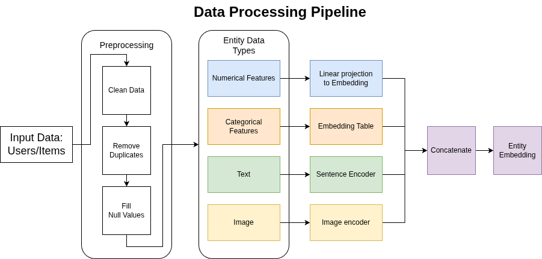
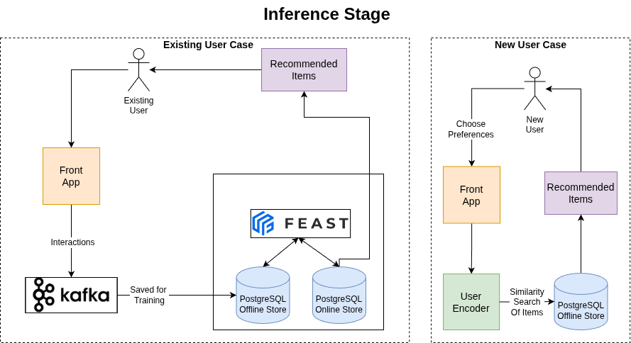

# AI Kickstart - Product Recommender System 

Welcome to the Product Recommender System Kickstart!
Use this to quickly get a recommendation engine with user-item relationships up and running in your environment.

To see how it's done, jump straight to [installation](#install). 

## Description 
The Product Recommender System Kickstart enables the rapid establishment of a scalable and personalized product recommendation service.

The system recommends items to users based on their previous interactions with products and the behavior of similar users.

It supports recommendations for both existing and new users. New users are prompted to select their preferences to personalize their experience.

Users can interact with the user interface to view items, add items to their cart, make purchases, or submit reviews.

### Recommendation algorithm stages:

1. **Filtering**
Removes invalid candidates based on user demographics (e.g., age, item availability in the region) and previously viewed items.

2. **Ranking**
Identifies the most relevant top-k items based on previuos intercations between users and items (trained with two-tower algorithm).

3. **Business Ordering**
Reorders candidates according to business logic and priorities.


### Product searching
To find products in the application you can do a:
* Text search (semantic search).
* Image search.
* Scroll recommended items.


## See it in action 

*This section is optional but recommended*
<!-- TODO do it at the end show UI gif of the usage -->

## Architecture diagrams
Components of Recommender System
<!--  TODO image of recommendation system infernece design -->

### Data Proprocessing



### Infernece
#### Exiting user case:
* Sending a get request from the EDB vectorDB to get the embedding of the existing user.
* Perform a similarity search on the item vectorDB to get the top k similar items.

#### New user case:
* The new users will be embedded into a vector representation.
* The user vector will do a similarity search from the EDB PGVector to get the top k suggested items




### Training & Batch scoring
#### Training
* Feast takes the Raw data (item table, user table, interaction table) and stores the items, users, and interactions as Feature Views.
* Using the Two-Tower architecture technique, we train the item and user encoders based on the existing user-item interactions.


#### Batch scoring
* After completing the training of the Encoders, embed all items and users, then push them in the PGVector database as embedding.
* Because we use batch scoring, we calculates for each user the top k recommended items using the item embeddings 
* Pushes this top k items for each user to the online store Feature Store.
## References 

*Section required. Include links to supporting information, documentation, or
learning materials.*

## Requirements

### Minimum hardware requirements 

Depend on the scale and speed required, for small amount of users have minimus of:
* No GPU required; for larger scale and faster preformance, use GPUs.
* 4 CPU cores.
* 16 Gi of RAM.
* Storage: 8 Gi (depend on the input dataset).

### Required software 

* Red Hat OpenShift.
* Red Hat OpenShift AI version 2.2 and above.
* Red Hat Authorino Operator (stable update channel, version 1.2.1 or later)
* Red Hat OpenShift Serverless Operator
* Red Hat OpenShift Service Mesh Operator

### Required permissions

* Standard user. No elevated cluster permissions required

## Install 

*Section is required. Include the explicit steps needed to deploy your
kickstart. If screenshots are included, remember to put them in the
`assets/images` folder.*

## Run Tests

1. Install dev dependancies

   ```bash
    pip3 install -r backend/pyproject-dev.toml
   ```


2. Run the tests

   ```bash
   PYTHONPATH=$(pwd) pytest backend
   ```
   
