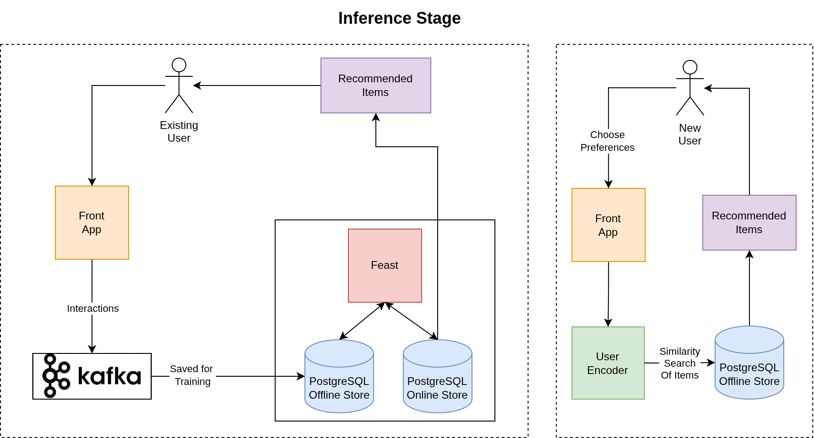
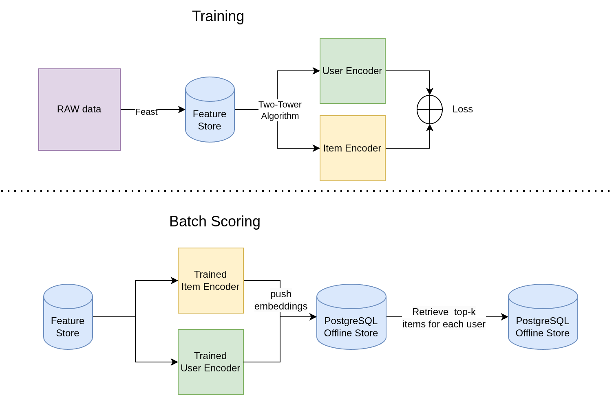

# product-recommender-system

Welcome to the Product Recommender System Kickstart!
Use this to quickly get a recommendation engine with user-item relationships up and running in your environment.

To see how it's done, jump straight to [installation](#install). 

## Description 
The Product Recommender System Kickstart is a template for deploying a highly scalable user-item recommendation system tailored to user preferences and demographics.

The system recommends items to users based on their previous interactions with products and the behavior of similar users.

It supports recommendations for both existing and new users. New users are prompted to select their preferences to personalize their experience.

Users can interact with the user interface to view items, add items to their cart, make purchases, or submit reviews.

### Recommendation algorithm stages:

1. **Filtering**
Removes invalid candidates based on user demographics (e.g., age, item availability in the region) and previously viewed items.

2. **Ranking**
Identifies the most relevant top-k items based on previuos intercations between users and items (trained with two-tower algorithm).

3. **Business Ordering**
Reorders candidates according to business logic and priorities.

### Product searching
To find products in the application you can do a:
* Text search (semantic search).
* Image search.
* Scroll recommended items.

## See it in action 

*This section is optional but recommended*
<!-- TODO do it at the end show UI gif of the usage -->

## Architecture diagrams
Components of Recommender System
<!--  TODO image of recommendation system infernece design -->

### Infernece

### Training & Batch scoring

## References 

*Section required. Include links to supporting information, documentation, or
learning materials.*

## Requirements

### Minimum hardware requirements 

Depend on the scale and speed required, for small amount of users have minimus of:
* No GPU required; for larger scale and faster preformance, use GPUs.
* 4 CPU cores.
* 16 Gi of RAM.
* Storage: 8 Gi (depend on the input dataset).

### Required software 

* Red Hat OpenShift.
* Red Hat OpenShift AI version 2.2 and above.
* Dependencies for Single-model server:
Red Hat OpenShift Service Mesh.
Red Hat OpenShift Serverless.

### Required permissions

* Standard user. No elevated cluster permissions required

## Install 

*Section is required. Include the explicit steps needed to deploy your
kickstart. If screenshots are included, remember to put them in the
`assets/images` folder.*